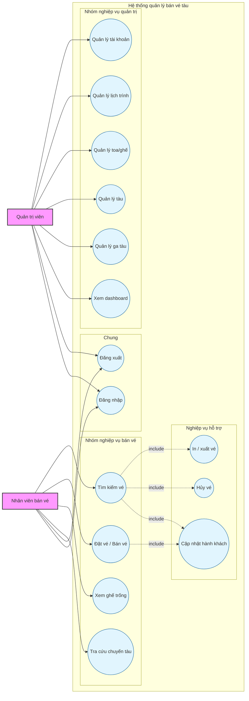
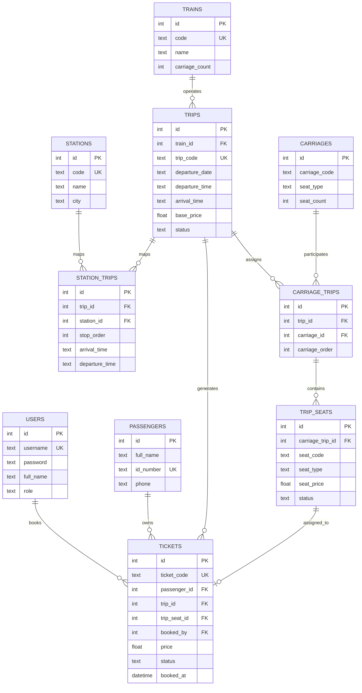

# Sơ đồ Use Case và ERD

## 1. Sơ đồ Use Case

## 2. Sơ đồ ERD

## 3. Ghi chú

- Sơ đồ use case bám theo mô tả ở `docs/tuan1/mo-ta-chuc-nang.md`.
- Sơ đồ ERD bên trên là phương án thiết kế đã điều chỉnh theo yêu cầu mới, chưa còn bám hoàn toàn schema hiện tại trong `src/train_ticket_app/backend/database.py`.
- Quan hệ `STATIONS - TRIPS` được biểu diễn theo N-N qua `STATION_TRIPS`, nhờ đó một chuyến từ điểm A đến điểm B có thể đi qua nhiều ga dừng trung gian theo `stop_order`.
- Quan hệ `CARRIAGES - TRIPS` được biểu diễn theo N-N qua `CARRIAGE_TRIPS`, nên toa tàu không bị cố định theo một `TRAIN` mà có thể được gán khác nhau cho từng chuyến/ngày chạy.
- Quan hệ `TRIP_SEATS` với `TICKETS` được biểu diễn là `0..1` theo mỗi ghế của một chuyến tại một thời điểm chỉ gắn với tối đa một vé đang tồn tại trong hệ thống.
