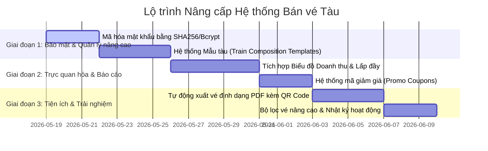

# Kế hoạch Phát triển & Nâng cấp Hệ thống Quản lý Bán vé Tàu
## Lộ trình Nâng cấp lên Hệ thống Chuẩn Doanh nghiệp (Production-Grade)

Dưới đây là kế hoạch chi tiết nhằm khắc phục các điểm hạn chế hiện tại của dự án, bổ sung các tính năng cao cấp và tối ưu hóa bảo mật, giúp ứng dụng của bạn đạt tiêu chuẩn xuất sắc nhất.

---

## 🗺️ Tổng quan lộ trình nâng cấp (Roadmap)

---

## 🛠️ Chi tiết các hạng mục nâng cấp theo từng Giai đoạn

### GIAN ĐOẠN 1: TỐI ƯU BẢO MẬT & QUẢN LÝ TIỆN ÍCH CORE
*Mục tiêu: Đưa các nghiệp vụ cơ bản lên chuẩn bảo mật và quản trị nâng cao.*

#### Hạng mục 1.1: Mã hóa mật khẩu người dùng (Password Hashing)
* **Hiện trạng**: Mật khẩu tài khoản nhân viên và Admin đang lưu dưới dạng văn bản thuần (Plaintext) trong database, cực kỳ nguy hiểm.
* **Giải pháp**:
  - Tích hợp thư viện bảo mật (ví dụ: `hashlib` hoặc `bcrypt`).
  - Khi tạo tài khoản mới hoặc đổi mật khẩu, áp dụng cơ chế muối hóa và băm mật khẩu (`PBKDF2-SHA256` hoặc `bcrypt`).
  - Cập nhật hàm `login` trong [service.py: L21](file:///c:/Users/Admin/Downloads/preparation/src/train_ticket_app/backend/service.py#L21) để so khớp mật khẩu đã băm thay vì so sánh chuỗi thô.

#### Hạng mục 1.2: Hệ thống Mẫu tàu (Train Composition Templates)
* **Hiện trạng**: Mỗi lần lập hành trình chuyến tàu mới (`Trip`), Admin phải chọn thủ công từng Toa tàu (`Carriage`) rất mất thời gian.
* **Giải pháp**:
  - Tạo bảng `train_templates` để định nghĩa sẵn các loại đoàn tàu (Ví dụ: *Tàu nhanh SE giường nằm*, *Tàu thường giá rẻ*, *Tàu tốc hành du lịch*).
  - Admin chỉ cần gán đoàn tàu chạy chuyến đó vào mẫu, hệ thống sẽ tự động cấu hình danh sách các toa xe tương ứng chỉ với **1 click**.

---

### GIAN ĐOẠN 2: BÁO CÁO TRỰC QUAN & LOGIC ĐẶT VÉ PHỨC TẠP
*Mục tiêu: Thêm biểu đồ trực quan hóa dữ liệu và công cụ tăng doanh số (Marketing).*

#### Hạng mục 2.1: Tích hợp Biểu đồ thống kê (Interactive Dashboard Charts)
* **Hiện trạng**: Tab "Tổng quan" chỉ hiển thị các con số text đơn giản.
* **Giải pháp**:
  - Tích hợp thư viện vẽ biểu đồ Python như `matplotlib` hoặc `pyqtgraph` vào PySide6.
  - Vẽ biểu đồ cột trực quan hiển thị **Doanh thu theo từng tháng** và **Tỷ lệ lấp đầy ghế ngồi theo từng chuyến tàu** giúp Admin dễ dàng đưa ra quyết định vận hành.

#### Hạng mục 2.2: Hệ thống Mã giảm giá (Promo Coupons)
* **Hiện trạng**: Giá vé tính cố định theo công thức cơ bản chặng đường.
* **Giải pháp**:
  - Tạo bảng `coupons` trong Database (gồm: mã code, phần trăm giảm, số tiền giảm tối đa, hạn sử dụng, số lượng tối đa).
  - Trên giao diện **Đặt vé**, thêm ô nhập "Mã giảm giá". Hệ thống tự động kiểm tra tính hợp lệ và trừ tiền trực tiếp vào hóa đơn trước khi người dùng nhấn thanh toán.

---

### GIAN ĐOẠN 3: TIỆN ÍCH PHỤ TRỢ & THÔNG TIN IN ẤN
*Mục tiêu: Hoàn thiện trải nghiệm người dùng cuối chuyên nghiệp.*

#### Hạng mục 3.1: Xuất vé PDF tự động kèm QR Code đặt chỗ
* **Hiện trạng**: Đặt vé xong chỉ hiện thông báo popup thô sơ.
* **Giải pháp**:
  - Sử dụng thư viện `reportlab` để kết xuất tự động hóa đơn bán vé/vé điện tử dạng **PDF** chuyên nghiệp.
  - Tích hợp mã **QR Code** chứa thông tin: Mã vé, Ga đi/Ga đến, Thời gian chạy, Tên hành khách, và Số ghế. 
  - Khách hàng hoặc nhân viên có thể in trực tiếp vé PDF này để kiểm tra khi lên tàu.

#### Hạng mục 3.2: Nhật ký hoạt động hệ thống (System Audit Log)
* **Hiện trạng**: Chưa có cơ chế theo dõi nhân viên nào đã đặt vé hoặc hủy vé nào.
* **Giải pháp**:
  - Tạo bảng `audit_logs` để ghi nhận mọi thao tác nhạy cảm: Ai đã xóa chuyến tàu, Ai đã hủy vé của khách, Vào thời gian nào, Trên IP nào.
  - Xây dựng màn hình xem nhật ký chỉ dành riêng cho Admin tối cao để giám sát hệ thống.

---